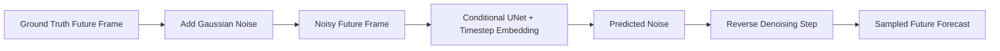

# 🔭 INSAT-3DR Cloud Motion Forecasting  
### Deterministic and Probabilistic Deep Learning for Short-Term Satellite Nowcasting

---

## 🌍 Motivation

Accurate short-term cloud motion forecasting (nowcasting) is critical for:

- Severe weather monitoring  
- Aviation safety  
- Renewable energy planning  
- Disaster preparedness  

Traditional approaches such as optical flow, block matching, and deterministic CNN-based methods often struggle with:

- Blurry predictions  
- Poor generalization during rapid atmospheric evolution  
- Inability to model uncertainty in chaotic weather systems  

This project explores both deterministic and probabilistic deep learning approaches for modeling cloud dynamics using multispectral satellite imagery from INSAT-3DR / INSAT-3DS.

---

## 🛰 Dataset

**Source:** MOSDAC – INSAT-3DR / 3DS Level-1C  

**Channels Used:**
- Visible (VIS)
- Infrared (IR)
- Water Vapor (WV)

**Preprocessing Pipeline:**
- HDF5 parsing  
- Channel normalization  
- Temporal window construction  
- Spatio-temporal sequence generation  

### Prediction Setup

| Input | Output |
|--------|--------|
| 4–6 past multispectral frames | 1–2 future cloud frames |

Sequences are constructed to model temporal cloud evolution dynamics.

---

## 🧠 Models Implemented

### 1️⃣ UNet Baseline (Deterministic Forecasting)

A multi-channel encoder–decoder CNN with skip connections.

**Key Features:**
- Multi-spectral input handling  
- Spatial feature preservation via skip connections  
- Direct future frame regression  
- Efficient training and inference  

This serves as a strong deterministic baseline for comparison.

---

### 2️⃣ Conditional Diffusion Model (Probabilistic Forecasting)

A Denoising Diffusion Probabilistic Model (DDPM) with a UNet backbone.

**Core Components:**
- Forward noise schedule  
- Reverse denoising process  
- Timestep embeddings  
- Conditional multi-frame input  

Instead of predicting frames directly, the model learns to model the distribution of future cloud states, enabling:

- Sharper outputs  
- Reduced blurring  
- Uncertainty-aware forecasting  
- Improved robustness under volatile atmospheric conditions  

---

## 📐 Architecture Overview

## 🧩 Deterministic UNet Architecture

## 🌫 Conditional Diffusion Architecture

---

## 📊 Evaluation Metrics

- Mean Squared Error (MSE)  
- Root Mean Squared Error (RMSE)  
- Structural Similarity Index (SSIM)  
- Visual qualitative comparisons  

## Author

Adityan Rajesh  
Artificial Intelligence & Data Science  
Amrita Vishwa Vidyapeetham

---

## License

MIT
